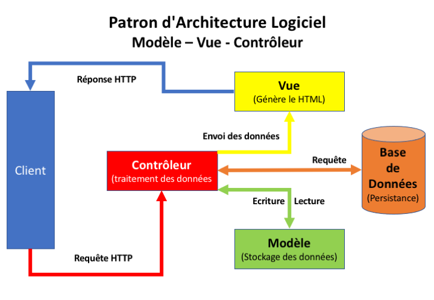
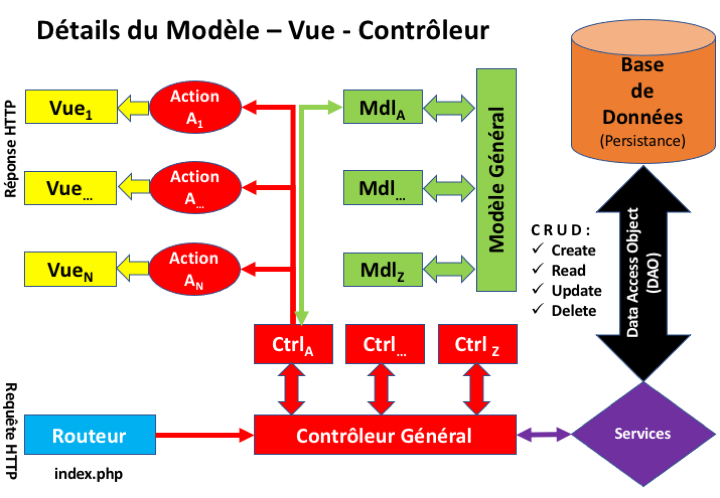

# MVC-Core

# Un MVC en PHP par L'Exemple (Modèle - Vue - Contrôleur)
( https://fr.wikipedia.org/wiki/Mod%C3%A8le-vue-contr%C3%B4leur)

Le propos de ce cours est de réaliser un « cas pratique » de mise en œuvre afin d’appréhender les intérêts du MVC.

## Pourquoi le MVC

L’utilisation d’un MVC en PHP, s’oppose à la pratique empirique de ce langage qui consiste à mélanger les connexions et accès à la base de données, avec le traitement des données et leur affichage.

Il est en effet courant d’avoir dans un seul script :

* du PHP,
* du SQL,
* du Javascript,
* du CSS dans les attributs des balises HTML.

soit pas moins de 5 langages distincts.

Au même titre qu’il est conseillé dans la présentation de séparer le HTML, qui structure le document, du CSS, qui l’habille, il est conseillé d’utiliser un patron d'architecture logicielle pour structurer une application web.

Les principaux avantages sont :

* Code(s) du projet réutilisable(s).
* Travail en groupe sur le projet.
* Code(s) évolutif(s).

## Principes du MVC

Créé en 1978, le MVC est un motif (ou patron) d'architecture logicielle destiné aux interfaces graphiques.
Il est particulièrement répendu dans les applications web.

Ce motif est en fait une combinaison de trois autres motifs ayant trois responsabilités différentes : les modèles, les vues et les contrôleurs.
* Le Modèle (Model) contient les données à afficher.
* La Vue (View) contient la présentation de l'interface graphique.
* Le Contrôleur (Controller) contient la logique à appliquer en fonction des actions effectuées par l'utilisateur.

Ce motif est utilisé par de nombreux « frameworks » (cadres d'applications : cadriciels) pour applications web tels que :
- Ruby on Rails (Ruby),
- ASP.NET MVC (C#),
- Spring, Struts2 (Java),
- CodeIgniter, Zend Framework, Symfony, Laravel (PHP),
- ou encore AngularJS (Javascript).

## Patrons de Conception

Le patron d'architecture logiciel MVC met plus particulièrement en oeuvre 3 patrons de conception (Design Pattern) qui sont :
1. Observateur : https://fr.wikipedia.org/wiki/Observateur_(patron_de_conception).
2. Stratégie : https://fr.wikipedia.org/wiki/Strat%C3%A9gie_(patron_de_conception).
3. Composite : https://fr.wikipedia.org/wiki/Composite_(patron_de_conception).
(https://fr.wikipedia.org/wiki/Patron_de_conception)

## Intégration dans une architecture 3-Tiers

Dans une architecture logicielle à 3 niveaux nous avons généralement :
* les données (data) : données persistantes ;
* les services : parties logiques de l'application ;
* la présentation : Interface Homme-Machine (IHM), Service Web (Web Service), etc.

Pour une application Web, le motif MVC intervient au niveau de la couche de présentation de l'architecture ci-dessus :
* les données : ... ;
* les services : ... ;
* la présentation :
    * Controller : intercepte la requête HTTP et renvoie la réponse HTTP ;
    * Model : stocke les données à afficher/traiter ;
    * View : organise la sortie/l'affichage.

Dans ce cadre là, le cycle de vie d'une requête HTTP typique est le suivant :

1. L'utilisateur envoie un requête HTTP via une URL ;
2. Le contrôleur l'intercepte ;
3. Le contrôleur appelle le service approprié ;
4. Le service appelle le DAO (Data Access Object : https://fr.wikipedia.org/wiki/Objet_d%27acc%C3%A8s_aux_donn%C3%A9es) approprié, qui renvoie des données persistantes (par exemple) ;
5. Le service traite les données les renvoie les données au contrôleur ;
6. Le contrôleur stocke les données dans le modèle approprié et appelle la vue appropriée ;
7. La vue est instanciée avec les données du modèle et est renvoyée en tant que réponse HTTP à l'Utilisateur.

Ce cycle peut ce modéliser graphiquement comme ceci :



Ou encore de manière plus détaillée :



L'arborescence de base du système de fichiers va être calquée sur les schémas ci-dessus :

```
├── README.md
├── bin
	   └── syncLocalRemote.sh
├── controllers
	   ├── Controller.php
	   └── OrderController.php
├── css
	   └── index.css
├── dao
	   └── DAO.php
├── data
	   └── Cars.php
├── etc
	   └── Config.php
├── images
	   ├── Logo_IUT-icon.png
	   └── Logo_IUT-small.png
├── index.php
├── js
	   └── index.js
├── models
	   ├── Model.php
	   └── OrderModel.php
├── sql
	   └── order.sql
└── views
	   ├── OrderCreateView.php
	   ├── View.php
	   └── templates
	  	     └── OrderCreate.tpl.php
```
